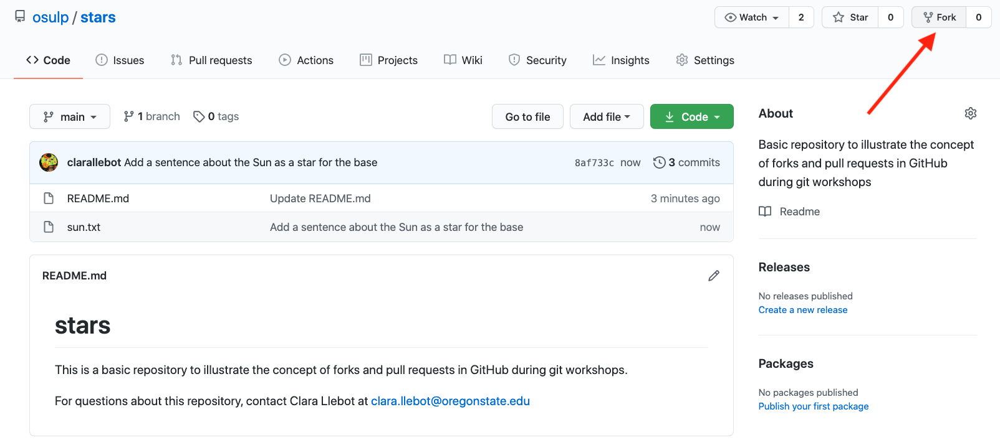
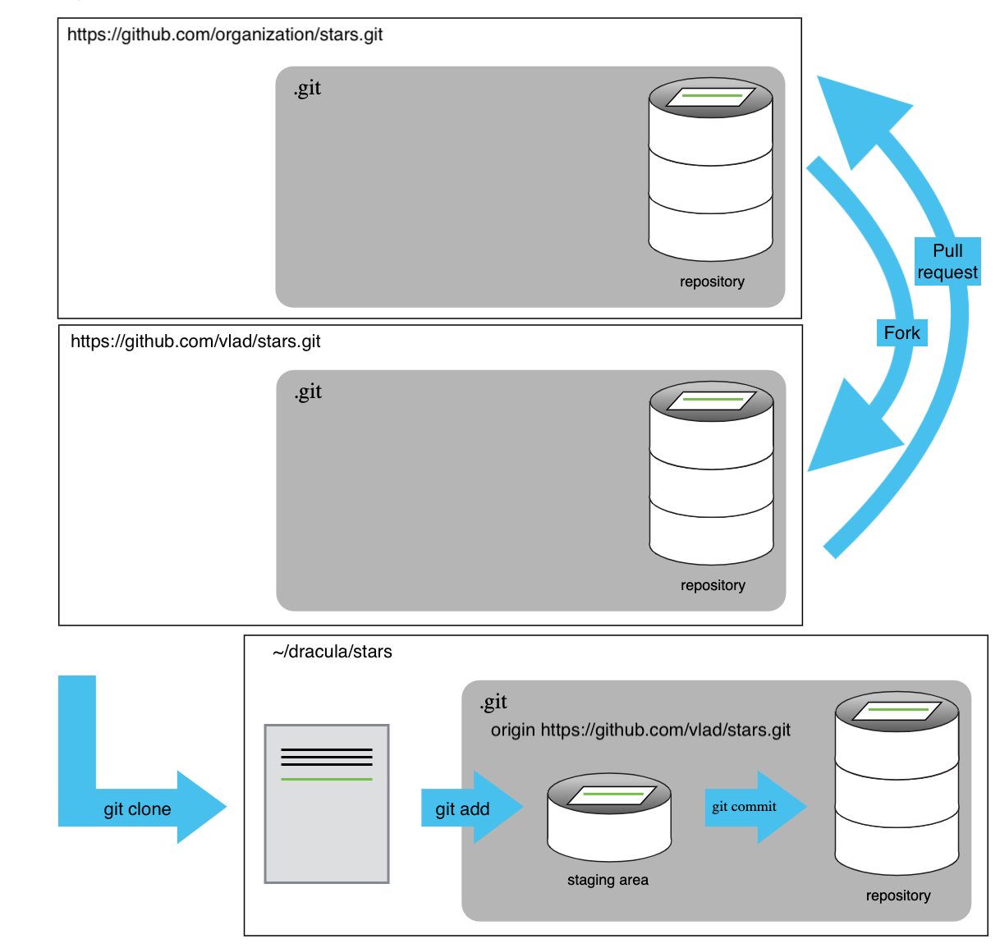
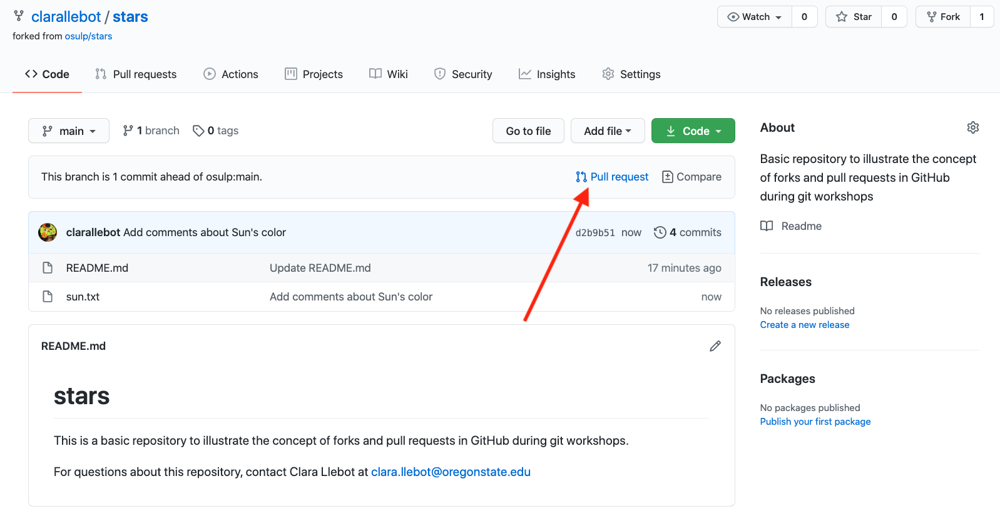
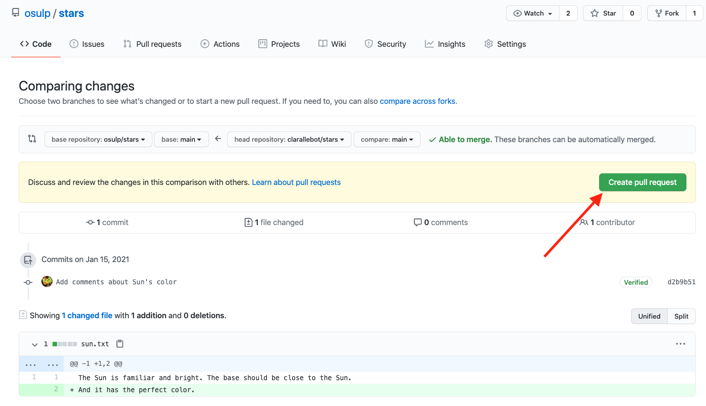
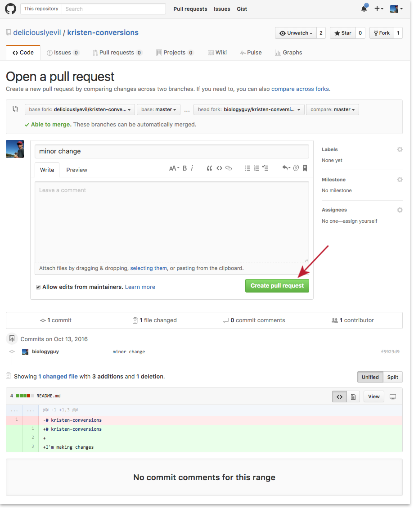
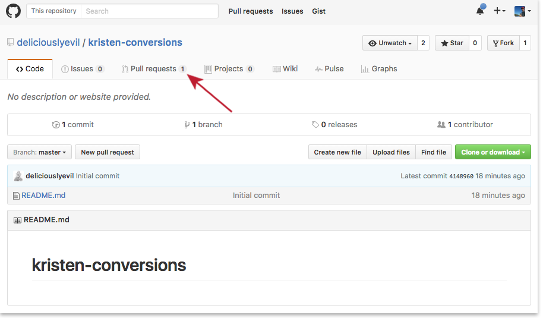
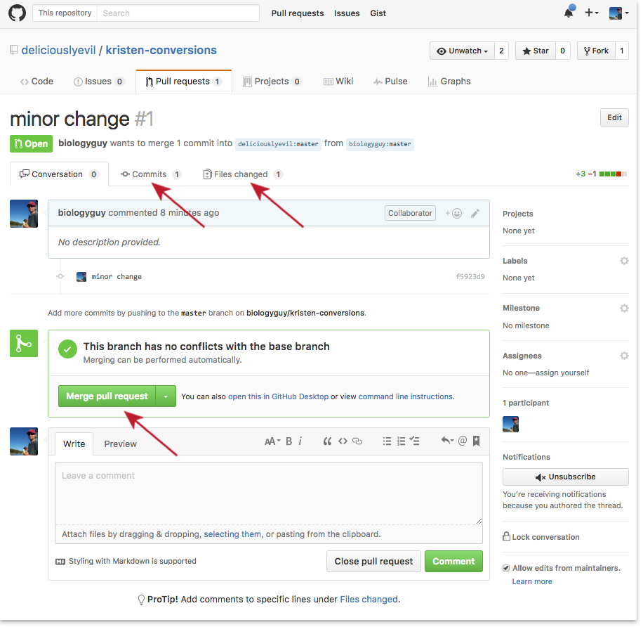

There are no shortage of projects on GitHub, and you will not be able
 to modify those repositories unless the owner gives you permission.
 Usually, owners do not like to give permission to strangers, so instead
 rely on selectively pulling commits from a **forked** version of their
 primary repository.

## Creating a fork

To create a fork if your partner's repository, go to their GitHub page,
select the repository, and click on the 'fork' button:

&nbsp;

This will create a copy of your partner's repository in your GitHub page.

Now clone the repository normally, so that you will have a local copy of the repository. 

~~~
$ git clone https://your-fork-of-your-partners-repo
~~~
{: .bash}

At this moment there are three identical copies of the repository:
* The organization's repository (in this case, your partner's repository). You usually don't have permission to edit that one.
* Your forked copy of the organization's repository in your GitHub space. 
* Your local copy of the repository in your GitHub space. 

Make changes to the files in your version of the repository the same way you would in
 any other. This is now **your** copy of the code, to do whatever you
 like with. 

## Contributing to a repo via pull request

Add another line into pluto.txt 

~~~
It is so a planet!
A planet with a charming heart on its surface; What's not to love?
It is a small planet, but we still like it.
~~~
{: .bash}

Create a commit, and push it to GitHub.

~~~
$ git add pluto.txt
$ git commit -m "Add considerations about Pluto's size"
$ git push
~~~
{: .bash}

You could now email the maintainer of the original repository to tell
 them about the cool new function you've written, and they could use
 the unique hash identifier of your commit to pull those changes into
 their own code base, but GitHub makes the process much easier with
 **Pull Requests**.

&nbsp;

Compare the changes you want to add to your pull request and send it off

&nbsp;

&nbsp;

## Accepting a pull request

The maintainer will most likely get an email about the new pull request,
 but if they don't, it will be visible to them next time the log into
 GitHub:

&nbsp;

Accepting the request is as simple as hitting the green button, **BUT BE
 CAREFUL!**. Always look at the commit history, and check what changes
 are included in the pull request. You don't want the merge to break
 your code. Check the '`Commits`' and '`Files changed`' tabs to be sure.

&nbsp;

> ## Practice makes perfect
>
> Fork your partner's repository and submit a pull request.
> 
> Also accept the pull request your partner has submitted.
{: .challenge}

> ## Be wary of the big green button
>
> Try to think of some reasons you may want to reject a pull request.
{: .challenge}

> ## Fork a public repo
>
> Browse the [GitHub Showcase](https://github.com/showcases) and try
> to find a repository that you think you might find useful (or that you 
> may want to contribute to!). Fork it!
{: .challenge}

