Most programming languages can be integrated with Git. If you code using a text editor, know that there are some that offer a good integration with Git, such as [Atom](https://atom.io/). If you use a programming language that involves an interface to work with it, like Matlab, it is worth taking some time to learn how to work with it.  

## Set up MATLAB with Git.

The first step is to create a repository with Git. There is a reminder for how to do this [here](https://osulp.github.io/git-beginner/07-github/index.html). For this exercise we will create a new repository named "matlab_example", but make sure that you choose better names than this for your real repositories. In this case this newly created repository is in [https://github.com/clarallebot/matlab_example](https://github.com/clarallebot/matlab_example). 

Now we go to our folder where we have the files that we want to version control, and right click. Select Source Control and then Manage Files. 

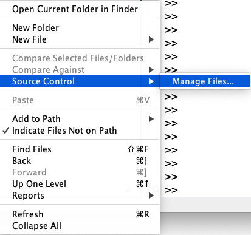

A new screen named "Manage Files Using Source Control" will appear. Choose Git as the Source control integration. 

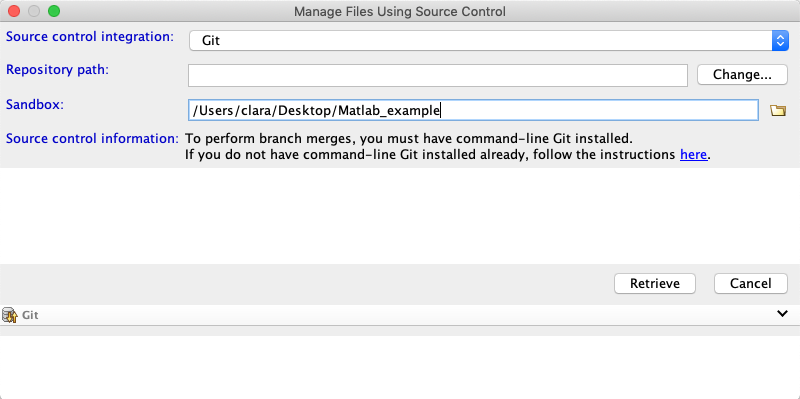

Click on Change and add the path of your repository. Go to the repository in Github and click on "Clone or Download". Copy the link. The link will look like `https://github.com/username/matlab_example.git`. Change the https at the beginning with a `git` so that it looks like `git://github.com/username/matlab_example.git`. You may be asked for your login password for authentication. Unfortunately just copying pasting the html path to your repository or copying the link provided by github under "Clone or Download" will not work. 

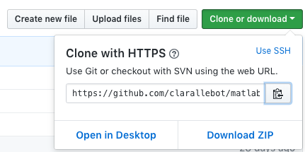

Click validate. If you have introduced the wrong path you will get something like 

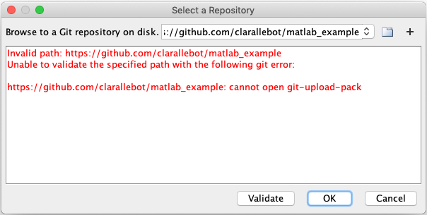

Hopefully everything worked correctly and you get a green Valid path message after validating:

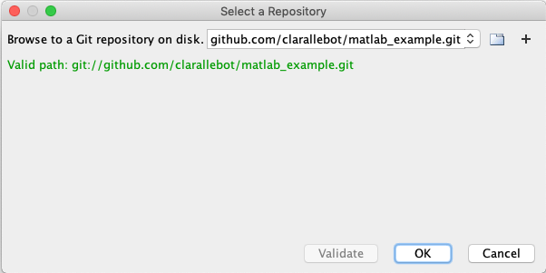

When you are back to the Manage Files Using Source Control panel make sure that the sandbox is the path to your current folder, the one that you want to version control with git. Click retrieve. All the files that you had in your repo should show up with a green circle next to them. If you created the repo with a readme file you should see the readme file in your folder. 

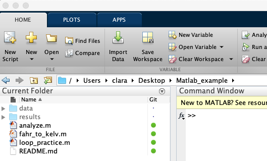

## Add a file to the repo

Create a new file. For example, a file named git_practice.m We can write anything in it, like a comment line. 
The file appears with a white circle next to it. It means that Git is not tracking this file yet. 

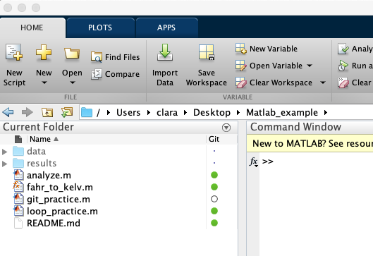

To add the file right click on the file and select Add to Git. 

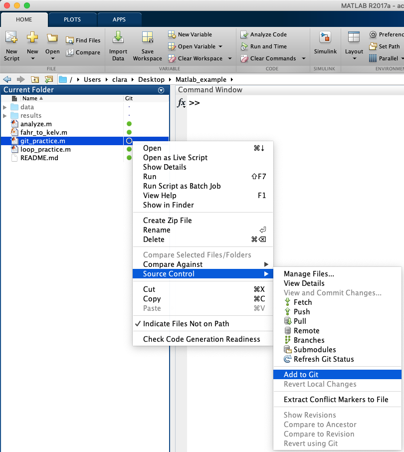

After adding the file, the symbol next to the file will be a plus sign. 

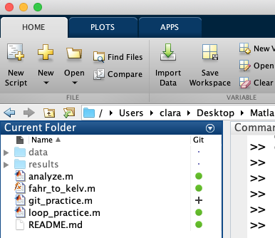

## Commit

Now we want to commit the file that we just added. To do that we right click on the empty space of our folder and choose `Source Control` and then `View and Commit changes`. 

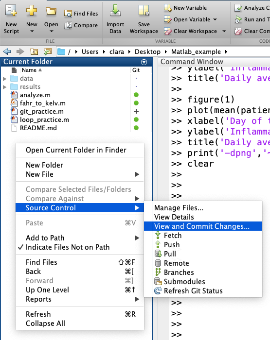

The new window offers us the opportunity to add a comment: Add new git_practice file to the repository. 

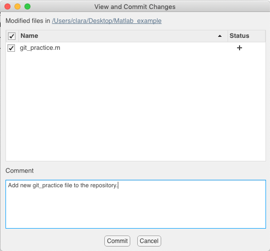

After clicking Commit the git_practice.m file has a green circle next to it. This means that it has been commited locally. 

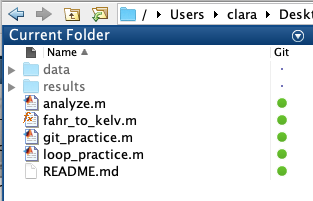

The source control menu has a push option. Selecting this option will push the changes that we saved in our local repository to our remote GitHub repository. 

Choose `Push` from the Source control menu to push to the remote repository.

NOTE: this lesson has been developed using the information in [Mathworks and Git](https://blogs.mathworks.com/community/2014/10/20/matlab-and-git/), a post by Ned Gulley on MathWorks Blogs. 
