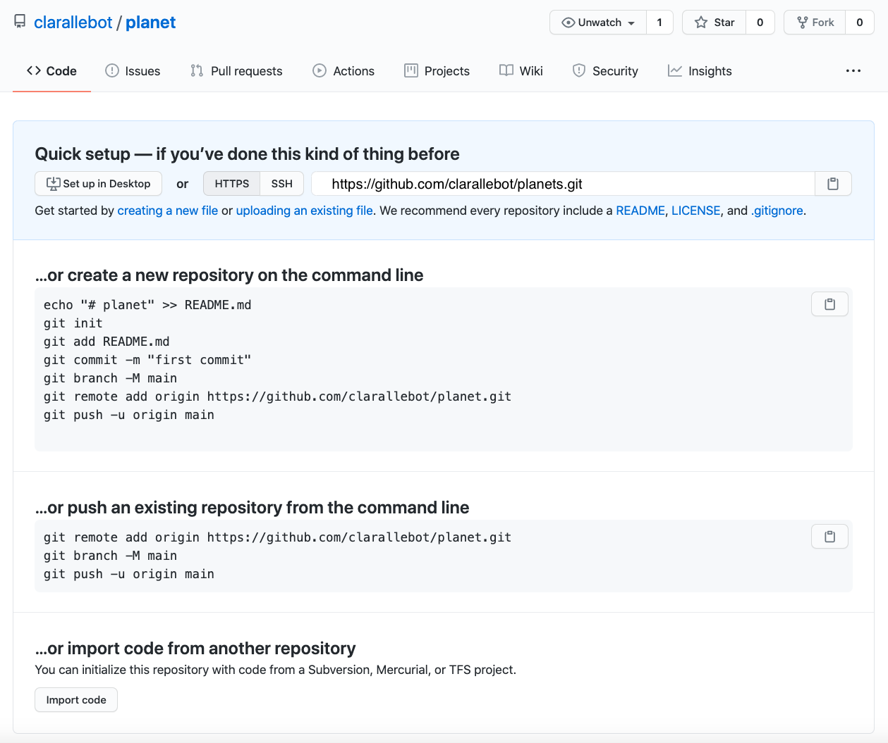

# This lesson

This is an Advanced Intro to Git lesson. This means that it is based on the [Intro to Git - beginner](https://osulp.github.io/git-beginner/) lesson. Below you will find a summary of the beginner lesson, so that you can get up to speed if you are coming to the advanced lesson without taking the beginning lesson first. Take into account that this is only a summary, so we will go over some concepts rather quickly. If you are not comfortable with some of the concepts outlined here, make sure to take the beginner lesson first.  

# Automated version control

Version control systems start with a base version of the document and
then record changes you make each step of the way. You can
think of it as a recording of your progress: you can rewind to start at the base
document and play back each change you made, eventually arriving at your
more recent version.

Once you think of changes as separate from the document itself, you
can then think about "playing back" different sets of changes on the base document, ultimately
resulting in different versions of that document. For example, two users can make independent
sets of changes on the same document - these changes can be organized into separate "branches", or groupings of work that can be shared. 

Unless there are conflicts, you can even incorporate two sets of changes into the same base document, or "merged".

A version control system is a tool that keeps track of these changes for us,
effectively creating different versions of our files. It allows us to
decide which changes will be made to the next version (each record of these changes is called a
[commit]({{ page.root }}/reference#commit)), and keeps useful metadata about them. The
complete history of commits for a particular project and their metadata make up
a [repository]({{ page.root }}/reference#repository). Repositories can be kept in sync
across different computers, facilitating collaboration among different people. Git offers a lightweight solution to frequent branching and merging of shared documents. 

# Setting up Git

When we use Git on a new computer for the first time,
we need to configure a few things.

On a command line, Git commands are written as `git verb options`,
where `verb` is what we actually want to do and `options` is additional optional information which may be needed for the `verb`. So here is how
Dracula sets up his new laptop:

~~~
$ git config --global user.name "Vlad Dracula"
$ git config --global user.email "vlad@tran.sylvan.ia"
~~~
{: .language-bash}

Please use your own name and email address instead of Dracula's. This user name and email will be associated with your subsequent Git activity,
which means that any changes pushed to
[GitHub](https://github.com/),
[BitBucket](https://bitbucket.org/),
[GitLab](https://gitlab.com/) or
another Git host server
in a later lesson will include this information.

# Creating a repository

Once Git is configured,
we can start using it.

We will continue with the story of Wolfman and Dracula who are investigating if it
is possible to send a planetary lander to Mars. 

First, let's create a directory in `Desktop` folder for our work and then move into that directory:

~~~
$ cd ~/Desktop
$ mkdir planets
$ cd planets
~~~
{: .language-bash}

Then we tell Git to make `planets` a [repository]({{ page.root }}/reference#repository)—a place where
Git can store versions of our files:

~~~
$ git init
~~~
{: .language-bash}

we can see that Git has created a hidden directory within `planets` called `.git`:

~~~
$ ls -a
~~~
{: .language-bash}

~~~
.	..	.git
~~~
{: .output}

Git uses this special sub-directory to store all the information about the project, 
including all files and sub-directories located within the project's directory.
If we ever delete the `.git` sub-directory,
we will lose the project's history.

We can check that everything is set up correctly
by asking Git to tell us the status of our project:

~~~
$ git status
~~~
{: .language-bash}
~~~
# On branch master
#
# Initial commit
#
nothing to commit (create/copy files and use "git add" to track)
~~~
{: .output}

If you are using a different version of `git`, the exact
wording of the output might be slightly different.

# Tracking changes

Let's create a file called `mars.txt` that contains some notes
about the Red Planet's suitability as a base.
We'll use `nano` to edit the file;
you can use whatever editor you like.

~~~
$ nano mars.txt
~~~
{: .language-bash}

Type the text below into the `mars.txt` file:

~~~
Cold and dry, but everything is my favorite color
~~~

`mars.txt` now contains a single line.

If we check the status of our project again,
Git tells us that it's noticed the new file:

~~~
$ git status
~~~
{: .language-bash}

~~~
On branch master

Initial commit

Untracked files:
   (use "git add <file>..." to include in what will be committed)

	mars.txt
nothing added to commit but untracked files present (use "git add" to track)
~~~
{: .output}

The "untracked files" message means that there's a file in the directory
that Git isn't keeping track of.
We can tell Git to track a file using `git add`:

~~~
$ git add mars.txt
~~~
{: .language-bash}

and then check that the right thing happened:

~~~
$ git status
~~~
{: .language-bash}

~~~
On branch master

Initial commit

Changes to be committed:
  (use "git rm --cached <file>..." to unstage)

	new file:   mars.txt

~~~
{: .output}

Git now knows that it's supposed to keep track of `mars.txt`,
but it hasn't recorded these changes as a commit yet.
To get it to do that,
we need to run one more command:

~~~
$ git commit -m "Start notes on Mars as a base"
~~~
{: .language-bash}

~~~
[master (root-commit) f22b25e] Start notes on Mars as a base
 1 file changed, 1 insertion(+)
 create mode 100644 mars.txt
~~~
{: .output}

When we run `git commit`,
Git takes everything we have told it to save by using `git add`
and stores a copy permanently inside the special `.git` directory.
This permanent copy is called a [commit]({{ page.root }}/reference#commit)
(or [revision]({{ page.root }}/reference#revision)) and its short identifier is `f22b25e`.
Your commit may have another identifier.

We use the `-m` flag (for "message")
to record a short, descriptive, and specific comment that will help us remember later on what we did and why.
If we just run `git commit` without the `-m` option,
Git will launch `nano` (or whatever other editor we configured as `core.editor`)
so that we can write a longer message.

[Good commit messages][commit-messages] start with a brief (<50 characters) statement about the
changes made in the commit. Generally, the message should complete the sentence "If applied, this commit will" <commit message here>.
If you want to go into more detail, add a blank line between the summary line and your additional notes. Use this additional space to explain why you made changes and/or what their impact will be.

If we run `git status` now:

~~~
$ git status
~~~
{: .language-bash}

~~~
On branch master
nothing to commit, working directory clean
~~~
{: .output}

it tells us everything is up to date.
If we want to know what we've done recently,
we can ask Git to show us the project's history using `git log`:

~~~
$ git log
~~~
{: .language-bash}

~~~
commit f22b25e3233b4645dabd0d81e651fe074bd8e73b
Author: Vlad Dracula <vlad@tran.sylvan.ia>
Date:   Thu Aug 22 09:51:46 2013 -0400

    Start notes on Mars as a base
~~~
{: .output}

`git log` lists all commits  made to a repository in reverse chronological order.
The listing for each commit includes
the commit's full identifier
(which starts with the same characters as
the short identifier printed by the `git commit` command earlier),
the commit's author,
when it was created,
and the log message Git was given when the commit was created.

Git insists that we add files to the set we want to commit
before actually committing anything. This allows us to commit our
changes in stages and capture changes in logical portions rather than
only large batches.
For example,
suppose we're adding a few citations to relevant research to our thesis.
We might want to commit those additions,
and the corresponding bibliography entries,
but *not* commit some of our work drafting the conclusion
(which we haven't finished yet).

To allow for this,
Git has a special *staging area*
where it keeps track of things that have been added to
the current [changeset]({{ page.root }}/reference#changeset)
but not yet committed.

# Remote repository

Version control really comes into its own when we begin to collaborate with
other people.  We already have most of the machinery we need to do this; the
only thing missing is to copy changes from one repository to another.

Systems like Git allow us to move work between any two repositories.  In
practice, though, it's easiest to use one copy as a central hub, and to keep it
on the web rather than on someone's laptop.  Most programmers use hosting
services like [GitHub](https://github.com), [BitBucket](https://bitbucket.org) or
[GitLab](https://gitlab.com/) to hold those master copies.

Let's start by sharing the changes we've made to our current project with the
world.  Log in to GitHub, then click on the icon in the top right corner to
create a new repository called `planets`:

Name your repository "planets" and then click "Create Repository":

As soon as the repository is created, GitHub displays a page with a URL and some
information on how to configure your local repository:

This effectively does the following on GitHub's servers:

~~~
$ mkdir planets
$ cd planets
$ git init
~~~
{: .language-bash}

Now that we have two repositories, we need a diagram like this:

Note that our local repository still contains our earlier work on `mars.txt`, but the
remote repository on GitHub appears empty as it doesn't contain any files yet.

The next step is to connect the two repositories.  We do this by making the
GitHub repository a [remote]({{ page.root }}/reference#remote) for the local repository.
The home page of the repository on GitHub includes the string we need to
identify it:

Click on the 'HTTPS' link to change the [protocol]({{ page.root }}/reference#protocol) from
SSH to HTTPS.

Copy that URL from the browser, go into the local `planets` repository, and run
this command:

~~~
$ git remote add origin https://github.com/vlad/planets.git
~~~
{: .language-bash}

Make sure to use the URL for your repository rather than Vlad's: the only
difference should be your username instead of `vlad`.

We can check that the command has worked by running `git remote -v`:

~~~
$ git remote -v
~~~
{: .language-bash}

~~~
origin   https://github.com/vlad/planets.git (push)
origin   https://github.com/vlad/planets.git (fetch)
~~~
{: .output}

The name `origin` is a local nickname for your remote repository. We could use
something else if we wanted to, but `origin` is by far the most common choice.

Once the nickname `origin` is set up, this command will push the changes from
our local repository to the repository on GitHub:

~~~
$ git push origin master
~~~
{: .language-bash}

~~~
Counting objects: 9, done.
Delta compression using up to 4 threads.
Compressing objects: 100% (6/6), done.
Writing objects: 100% (9/9), 821 bytes, done.
Total 9 (delta 2), reused 0 (delta 0)
To https://github.com/vlad/planets
 * [new branch]      master -> master
Branch master set up to track remote branch master from origin.
~~~
{: .output}

Our local and remote repositories are now in this state:

Our local and remote repositories are now in this state:

